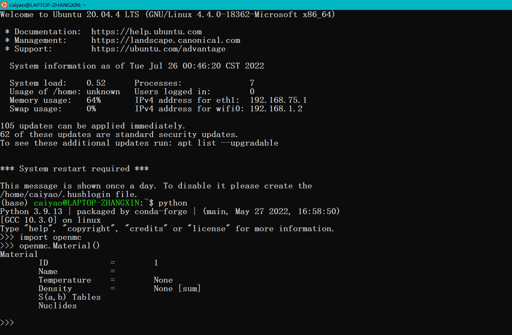

# Install OpenMC in Windows (wsl2)😊. Change sources for download(for Chinese users)👌.
[](https://docs.openmc.org/en/latest/license.html)

**[The OpenMC project aims to provide a fully-featured Monte Carlo particle
transport code based on modern methods. It is a constructive solid geometry,
continuous-energy transport code that uses HDF5 format cross sections. The
project started under the Computational Reactor Physics Group at MIT.](https://github.com/openmc-dev/openmc)**

****************************
# **大家好，我是一名人菜瘾大的计算机新手。由于专业需要，我要在这个暑假（2022/7-8）学习蒙特卡洛方法在核物理方面的应用（OpenMC）。经过近一个星期的瞎搞（我几乎用了官方文档中的每一个方法，除了Mac平台上的😂），终于在wsl2上差不多完成，现在分享给大家，希望不要像我一样惨🤞。**
## **Hello everyone, I am a computer green hand but addicted to computer. Due to the need of my major, I need to learn the application of Monte Carlo method in nuclear physics(OpenMC) in this summer vacation (2022/7-8). After nearly a week of messing around (I used almost every method in the official documentation except 😂 on Mac), it's almost done on WSL2, and I'm sharing it with you, hopefully not as bad as I did 🤞.**

*******************************
* # 要求
* # requirement
  * ## [wsl2(I used ubuntu20.04)](https://docs.microsoft.com/en-us/windows/wsl/install-manual#step-4---download-the-linux-kernel-update-package)

******************************
* # 换源 
* # Change sources（just for needed）

## 换ubnutu的源
## Change ubuntu's source
```
cd ~
```
```
sudo cp /etc/apt/sources.list /etc/apt/sources.list.bak
```
```
sudo vim /etc/apt/sources.list
```
[用下列链接替换上面原有的(replace it ⬇)](https://blog.csdn.net/qq_40520596/article/details/110194439)
```
# 默认注释了源码镜像以提高 apt update 速度，如有需要可自行取消注释
deb https://mirrors.tuna.tsinghua.edu.cn/ubuntu/ focal main restricted universe multiverse
# deb-src https://mirrors.tuna.tsinghua.edu.cn/ubuntu/ focal main restricted universe multiverse
deb https://mirrors.tuna.tsinghua.edu.cn/ubuntu/ focal-updates main restricted universe multiverse
# deb-src https://mirrors.tuna.tsinghua.edu.cn/ubuntu/ focal-updates main restricted universe multiverse
deb https://mirrors.tuna.tsinghua.edu.cn/ubuntu/ focal-backports main restricted universe multiverse
# deb-src https://mirrors.tuna.tsinghua.edu.cn/ubuntu/ focal-backports main restricted universe multiverse
deb https://mirrors.tuna.tsinghua.edu.cn/ubuntu/ focal-security main restricted universe multiverse
# deb-src https://mirrors.tuna.tsinghua.edu.cn/ubuntu/ focal-security main restricted universe multiverse

# 预发布软件源，不建议启用
# deb https://mirrors.tuna.tsinghua.edu.cn/ubuntu/ focal-proposed main restricted universe multiverse
# deb-src https://mirrors.tuna.tsinghua.edu.cn/ubuntu/ focal-proposed main restricted universe multiverse
```
```
source /etc/apt/sources.list
```
```
sudo apt update
```
## 配置conda和pip，并换源
## Configure conda and pip，and change their sources
```
cd ~
```
```
wget https://mirrors.tuna.tsinghua.edu.cn/anaconda/miniconda/Miniconda3-py39_4.12.0-Linux-x86_64.sh
```
都选yes就行⬇
Keep yes⬇
```
bash Miniconda3-py39_4.12.0-Linux-x86_64.sh
```
要重启再进入环境⬆
Need restart⬆
到了conda⬇
For conda⬇
```
conda config --add channels https://mirrors.ustc.edu.cn/anaconda/pkgs/main/
conda config --add channels https://mirrors.ustc.edu.cn/anaconda/pkgs/free/
conda config --add channels https://mirrors.ustc.edu.cn/anaconda/cloud/conda-forge/
conda config --add channels https://mirrors.ustc.edu.cn/anaconda/cloud/msys2/
conda config --add channels https://mirrors.ustc.edu.cn/anaconda/cloud/bioconda/
conda config --add channels https://mirrors.ustc.edu.cn/anaconda/cloud/menpo/
conda config --set show_channel_urls yes
conda update conda
```
到了pip⬇
For pip⬇
```
conda install pip
pip install -i https://pypi.tuna.tsinghua.edu.cn/simple --upgrade pip
pip config set global.index-url https://pypi.tuna.tsinghua.edu.cn/simple

```
* # 配置OpenMC
* # Configure OpenMC
## [依赖项(可能会更新哦)](https://github.com/openmc-dev/openmc/blob/develop/docs)
## [Dependencies (subject to update)](https://github.com/openmc-dev/openmc/blob/develop/docs)
```
cd ~
```
```
sudo apt install git cmake g++ mpich gfortran libhdf5-dev libpng-dev libeigen3-dev libmpich-dev libnetcdf-dev libtbb-dev libgles2-mesa-dev
```
```
#pip install -r requirements-rtd.txt⬇
pip install sphinx==5.0.2 sphinx_rtd_theme==1.0.0 sphinx-numfig jupyter sphinxcontrib-katex sphinxcontrib-svg2pdfconverter numpy scipy h5py pandas uncertainties matplotlib
```
还有个OpenMOC，以后会用到⬇
There's also OpenMOC, which we'll use in the future⬇
```
cd ~
```
```
pip install swig pillow # Because above,this is enough.
#pip install swig numpy matplotlib h5py pillow
```
```
git clone https://github.com/mit-crpg/OpenMOC.git
#git clone https://gitclone.com/github.com/mit-crpg/OpenMOC.git
```
[这个快一些⬆](https://www.hurbai.com/resource/642)
[For faster git⬆](https://www.hurbai.com/resource/642)
```
cd OpenMOC
```
```
python setup.py install --user
```
```
pip install .
```
## 安装OpenMCヾ(≧▽≦*)o
## Install OpenMCヾ(≧▽≦*)o
```
cd ~
```
```
git clone https://github.com/openmc-dev/openmc.git
#git clone https://gitclone.com/github.com/openmc-dev/openmc.git
```
```
cd openmc
```
```
pip install . && cmake .
```
```
sudo make install
```
要花点时间⬆
It takes time⬆

就这!That is it!

## 更多
## More
* ## [Configurate Cross Section (Master recommended ENDF—B7👌)](https://docs.openmc.org/en/stable/usersguide/cross_sections.html)
* ## [Unzip the lib](https://docs.openmc.org/en/stable/usersguide/cross_sections.html)
* ## [Configurate the Cross Section Path](https://openmc.discourse.group/t/how-does-openmc-locate-the-jeff33-endfb-libraries/1349)
* ## [jupyter + wsl2](https://www.wolai.com/file408/fVX9LNEdSKw9vaiYpoz9aW)
* ## [vscode + wsl2](https://blog.csdn.net/weixin_43876113/article/details/105261577)


* ## If you use OpenMC in your research, please consider giving proper attribution by citing the following publication:

  - **Paul K. Romano, Nicholas E. Horelik, Bryan R. Herman, Adam G. Nelson, Benoit
  Forget, and Kord Smith, "[OpenMC: A State-of-the-Art Monte Carlo Code for
  Research and Development](https://doi.org/10.1016/j.anucene.2014.07.048),"
  *Ann. Nucl. Energy*, **82**, 90--97 (2015).**
## 执照
## License

This is distributed under the MIT/X
[license](https://docs.openmc.org/en/stable/license.html).

## 参考
## Reference
[以上所以链接均来自各个平台，各位网友。如有侵权，我立即修改🌷。](https://github.com/zx2810)

[Above so link all come from each platform, each netizen. If there is infringement, I immediately modify🌷。](https://github.com/zx2810)
